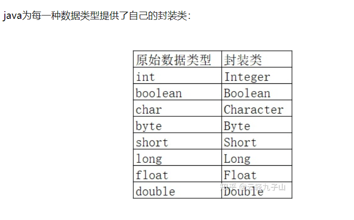

> **问题描述：**
>> 将一个字符串str的内容颠倒过来，并输出。str的长度不超过100个字符。 如：输入“I am a student”，输出“tneduts a ma I”。

* 方法一：
  
  利用StringBuffer类函数方法reverse()直接实现。
 
  ~~~java
  StringBuffer str = new StringBuffer();
  str.append(scan.nextLine());
  System.out.println(str.reverse());
  ~~~

* 利用堆栈实现
  
  利用堆栈“后进先出”的原则，实现
  ~~~java
   String str = scan.nextLine();
   Stack<Character> st = new Stack<Character>();
   for(char c : str.toCharArray()) {
                         st.push(c);
                    }
    while(!st.empty()){
       System.out.print(st.peek()); //查看栈顶元素
       st.pop();
                              }              
        System.out.println("");
                            }
  ~~~

  Stack模板中间参数需要，数据类型的封装类来实现，例如char类型替代Character
  