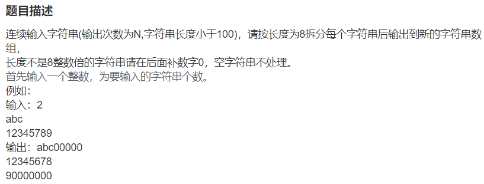

* 此题其实难度不大，主要要理解substring用法，以及后面补零的操作。
  
  substring用法：
  

我写的思路稍微复杂一点，利用Arraylist数组存取分割后的string，最后判定是否要补0操作，其实可以，直接简化，先进行补0操作，直接输出分割的字符串即可。简化版关键代码如下：
~~~java
 while(str.length() % 8!=0)   //先进行补0操作
            str += '0';
 for(int i = 0;i < str.length();i = i + 8){
            System.out.println(str.substring(i, i+8));
        }
~~~